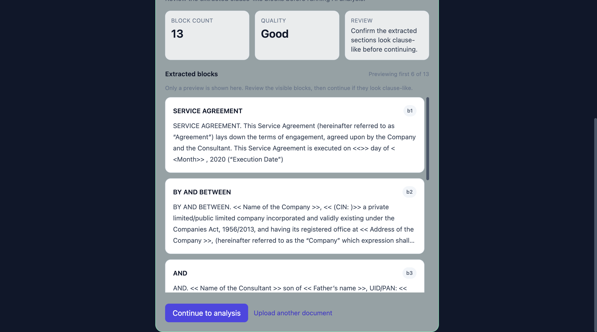
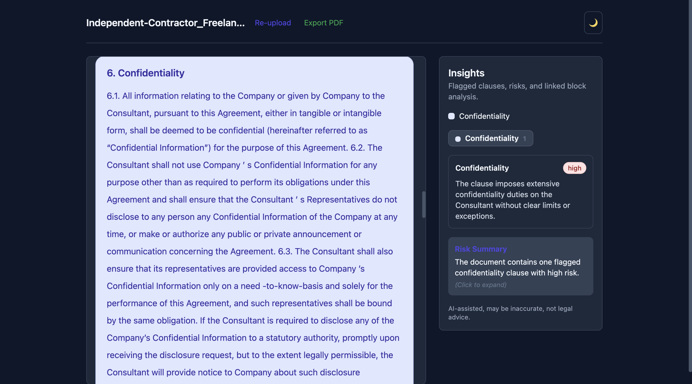
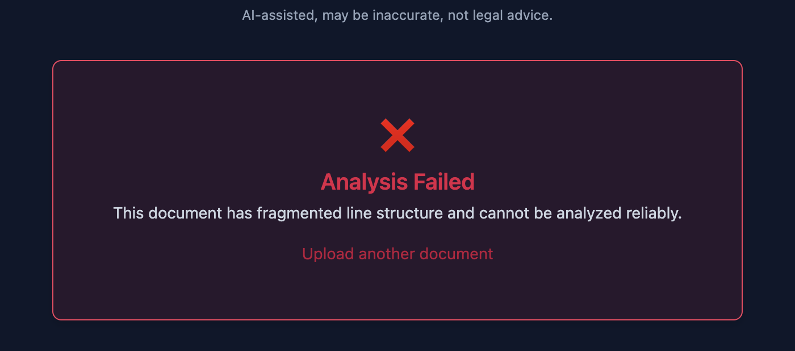

# Legal Document Analyzer

A contract review app that parses a document into clause-like blocks, runs AI analysis on those blocks, and presents the result in a viewer that keeps flagged clauses separate from routine or noisy text.

This project is intentionally narrow. It is built around structured agreements and a block-first review flow, not around trying to produce a single all-knowing legal summary.

## Demo

Live:

- [legal-doc-analyzer-livid.vercel.app](https://legal-doc-analyzer-livid.vercel.app/)

Screenshots:

### Preprocess preview



### Viewer



### Quality gate rejection



## What it does

- accepts `PDF`, `DOCX`, and `TXT`
- parses the document in the browser
- extracts clause-like blocks before AI analysis
- shows a preprocessing preview with:
  - quality status
  - warning signals
  - extracted block preview
- runs AI analysis on the extracted blocks
- classifies every block as:
  - `clause_flagged`
  - `clause_no_issue`
  - `noise`
- shows flagged clauses in a focused review panel
- exports the reviewed result as PDF

## Why I built it this way

The original problem I wanted to avoid was the common “upload a contract, get one large AI answer” pattern. It is hard to inspect, hard to debug, and easy to distrust.

So the project is built around a different idea:

1. parse first
2. extract reviewable blocks
3. validate the structure before calling AI
4. require one AI result per block
5. map the result back onto the document in the UI

That decision shaped most of the project:

- the preprocessing gate exists to stop obviously weak inputs early
- the viewer is block-based instead of summary-based
- the right panel only shows flagged clauses
- the backend validates AI output strictly enough that the frontend is not guessing what to render

## What is interesting here

From an engineering point of view, the parts I would point a reviewer to first are:

- the preprocessing gate, which checks whether the extracted structure is worth analyzing
- the viewer model, which separates flagged clauses from no-issue and noise states
- the AI contract, which requires exhaustive block coverage instead of returning only a few “important” clauses
- the eval harness used to tune prompt behavior without burning tokens blindly

This is not a legal reasoning engine. It is a frontend-heavy document review flow with a more disciplined AI boundary than the usual demo pattern.

## Current review model

The backend returns one result for every extracted block.

Example shape:

```json
{
  "documentId": "doc_123",
  "results": [
    {
      "blockId": "b7",
      "classification": "clause_flagged",
      "clauseType": "Security Deposit",
      "riskLevel": "medium",
      "title": "Possession retention for security deposit",
      "explanation": "The clause allows possession to be retained until the deposit is refunded."
    },
    {
      "blockId": "b8",
      "classification": "clause_no_issue",
      "clauseType": "Subletting Restrictions",
      "riskLevel": "none"
    },
    {
      "blockId": "b24",
      "classification": "noise",
      "riskLevel": "none"
    }
  ],
  "summary": "The document contains flagged clauses related to the security deposit and overstay penalty."
}
```

Frontend behavior:

- `clause_flagged`
  - highlighted on the left
  - shown in the right panel
  - included in export details
- `clause_no_issue`
  - shown only in the left panel
  - labeled as `No notable issue detected`
- `noise`
  - shown only in the left panel
  - labeled as `No clause detected`
- `unclassified`
  - frontend fallback if a block is missing from the result

## Scope

Works best on:

- NDAs
- service agreements
- consulting agreements
- rental agreements
- other digitally generated, clause-structured contracts

Weaker on:

- scanned or image-based PDFs
- documents with broken text extraction
- highly fragmented layouts
- documents with repeated page furniture that bleeds into content

## Stack

- React 19
- Vite
- Tailwind CSS
- React Router
- `pdfjs-dist`
- `mammoth`
- `html2pdf.js`
- Vercel-style serverless API (`api/analyze.js`)
- OpenAI
- Cloudflare Turnstile
- Upstash Redis

## Local setup

```bash
npm install
cp .env.example .env
```

### Frontend env

- `VITE_TURNSTILE_SITE_KEY`
- `VITE_API_BASE_URL`
- `VITE_USE_MOCK_ANALYZER`
- `VITE_MAX_UPLOAD_MB`
- `VITE_MAX_DOC_CHARS`

### Backend env

- `OPENAI_API_KEY`
- `OPENAI_MODEL`
- `OPENAI_TIMEOUT_MS`
- `TURNSTILE_SECRET_KEY`
- `UPSTASH_REDIS_REST_URL`
- `UPSTASH_REDIS_REST_TOKEN`
- `RATE_LIMIT_PREFIX`

## Running locally

Recommended setup:

```bash
npx vercel dev --listen 3000
```

In another terminal:

```bash
npm run dev
```

Then point the frontend to the local API:

```bash
VITE_API_BASE_URL=http://localhost:3000
```

If I only want to work on the UI flow, I use:

```bash
VITE_USE_MOCK_ANALYZER=true
```

## Scripts

```bash
npm run dev
npm run build
npm run preview
npm run lint
npm run test:corpus
npm run corpus:report
```

## Testing

Useful fixture documents:

- `tests/fixtures/corpus/NON_DISCLOSURE_AGREEMENT.pdf`
- `tests/fixtures/corpus/RENTAL AGREEMENT.pdf`
- `tests/fixtures/corpus/EX-99.(d)(2).pdf`

Corpus test:

```bash
npm run test:corpus
```

AI eval harness:

```bash
node tests/evals/legal-analysis.eval.mjs
OPENAI_API_KEY=... node tests/evals/legal-analysis.eval.mjs --mode=live
```

The eval harness exists because prompt tuning by manual trial and error gets expensive quickly. It gives a fixed mini-corpus, strict pass criteria, and a way to compare prompt changes without using the full app for every iteration.

## Deployment

Vercel is the intended deployment target.

At deploy time:

- set frontend env vars
- set backend env vars
- verify Turnstile on the deployed hostname
- smoke test `/api/analyze`

## Limitations

- AI output is for review triage, not legal advice
- the summary is secondary to the block-level output
- local mobile testing of Turnstile is awkward because hostname rules matter
- large documents can occasionally take longer to analyze than smaller ones

## If I had more time

- improve repeated-header/footer cleanup before block extraction
- add a small deployment checklist with screenshots
- add one or two more corpus fixtures with messier formatting

## Notes

This project is scoped to be inspectable end to end. The goal was not to make the AI sound impressive. The goal was to make the system easier to reason about when the AI is imperfect.

## License

MIT
